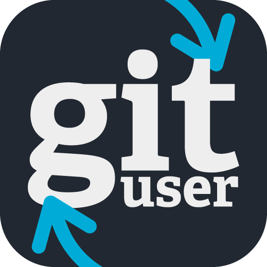
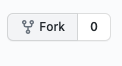

# How to contribute to Go-Gituser



Hello there 👋🏼 <br>
Welcome to the contribution guide.

If you haven't already, please read about this program in our [README](README.md).

## Setup project in your machine

#### Fork this repository



Fork this repository by clicking on the fork button on the top of the main page.
This will create a copy of this repository in your account.

#### Clone the repository

Now clone the forked repository to your machine.

```
git clone <forked repo url>
```

### Install program

- Fill out the `data/config.json` with your accounts.
- Follow the installation steps [here](MACOS_PATH.md).

## Create a new branch

Please use the following convention for your branch name:

### Types of branches

- **chore**: Changes in the chore of the project.
- **doc**: Documentation or assets changes.
- **feat**: Adding a new feature.
- **fix**: Fixing a bug.
- **refactor**: A code change that neither fixes a bug nor adds a feature.
- **test**: Adding missing tests or correcting existing tests.

Tour branch name should be :

```
<type>/<description>
```

<em> Some Examples: </em>

```
git checkout -b feat/addCurrentDate
```

```
git checkout -b fix/executingError
```

```
git checkout -b ui/changedIcons
```

```
git checkout -b doc/improvedInstallationGuide
```

```
git checkout -b chore/addNewPackage
```

Create a branch using the `git checkout` command:

```
git checkout -b <branch-name>
```

Now in this branch you can code your changes 😀

## Submitting your changes

To submit your changes, use the traditional `git add` && `git commit -m`
Please, try to follow the [commit convention](#Commit-conventions) I am trying to put in place.

```
git add <file>
```

```
git commit -m <commit message>
```

### Commit conventions

To optimize commit readability, I am trying to put in place the following convention:

```
<type>: <description>
  │                │
  │                └─⫸ Description of the changes.
  │
  └─⫸ Commit Type: chore|doc|feat|fix|ui|refactor|test
```

<b>Types of commits </b>

Must be one of the following:

- **chore**: Changes in the chore of the project.
- **doc**: Documentation or assets changes.
- **feat**: Adding a new feature.
- **fix**: Fixing a bug.
- **refactor**: A code change that neither fixes a bug nor adds a feature.
- **test**: Adding missing tests or correcting existing tests.

### Push your code

```
git push
```

If you have a `git push --set-upstream origin <branch-name>` message. Copy and run it that command so you can push your branch.

```
git push --set-upstream origin <branch-name>
```

## Create a Pull Request

After pushing your branch normally you'll have a link to create a pull request in your terminal. Click on that link. <br>
If you don't find it go to your github repo, find your branch and click the button <b>Create a Pull Request</b>

To submit the Pull Request(PR) write a `Title`, `Leave a message` and press `Create pull request` button.

<hr>

## How to update

At this moment if you run `git remote -v` you'll see that your forked repo is your origin. This is what we want because it's there where you'll push your changes.

However if the <b> go-gituser </b> root program changes, you may have to updated and make a git pull from `lucasnevespereira/go-gituser` and not your forked repo.
To handle this situation we are going to add a second remote poiting to the root project, we are going to call it `upstream`

```
git remote add upstream https://github.com/lucasnevespereira/go-gituser
```

### Update

Now if you want to update your forked repo from the root repo, run :

```
git pull upstream main
```

<hr>

Thanks,
Lucas N. Pereira, Go-Gituser
