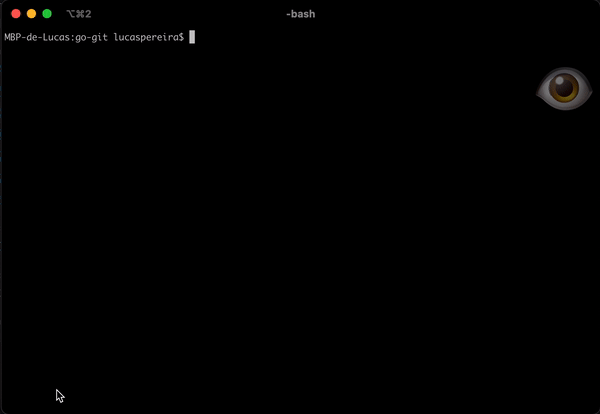

# Go-gituser

This program is a Golang Command Line Tool that helps switch between Git User Accounts easily.



It automates the following commands:

```
git config --global user.name "yourUsername"
```

```
git config --global user.email "yourEmail"
```

#### Modes

There is currently 3 modes in this script:

- "work" : for a work related git account.
- "school" : for a school related git account.
- "personal" : for a personal related git account.

#### Configuration

To add your respective accounts, you need to fill out the `data/config.json` file.

```
{
  "personalUsername": "enterYourUsernameHere",
  "personalEmail": "enterYourEmailHere",
  "schoolUsername": "enterYourUsernameHere",
  "schoolEmail": "enterYourEmailHere",
  "workUsername": "enterYourUsernameHere",
  "workEmail": "enterYourEmailHere"
}

```

## Usage

<i>Attention: </i> Make sure you've entered your information in `config.json` before compile program

Compile by running `go build -o gituser`

Call executable file with mode

```
./gituser <mode>
```

Examples:

```
./gituser work
```

```
./gituser school
```

```
./gituser personal
```

#### Flags

There is a flag `--help` that will print some information about the program.

`./gituser --help`

There is a flag `--info` that will print some information about the accounts.

`./gituser --info`

### Additional Information

To call the executable globally in your machine you can add the program to your PATH. (MACOS)<br>
[See Details here](MACOS_PATH.md)

<hr>

## License

This project is under [MIT LICENSE](LICENSE)
