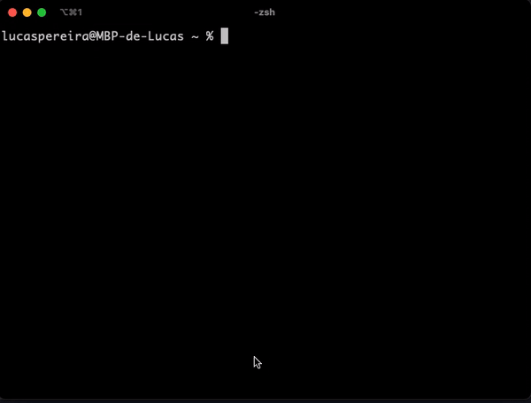

## Overview

User of multiple git accounts, in order to meet my need to switch regularly between these accounts (student, professional, personal), I developed an open source cli (a command line interface) in Golang.

This program helps switch between different git user accounts easily.



It automates the following commands:

```
git config --global user.name "yourUsername"
```

```
git config --global user.email "yourEmail"
```

#### Modes

There is currently 3 modes in this script:

- 💻 <b>work</b> : for a work related git account.
- 📚 <b>school</b> : for a school related git account.
- 🏠 <b>personal</b> : for a personal related git account.

## How to install

### Prerequesites

At this moment to use this program you need to have `go`.

Install with Homebrew

```
brew update
```

```
brew install go
```

or visit https://golang.org/doc/install

### Setup Globally

Make sur your bin path is in your `$PATH`, you can check in your `.zshrc` or `.bash` file.

_e.g_
```shell
export PATH="$HOME/bin:$PATH"
```

Run the following command from the root of the project:

```
make install
```
<em>This will build gituser and move it to your `$HOME/bin`</em>

Now you can call `gituser` globally 😀

### Add your git account data

Run the following command :

```
gituser config
```

<em>This command will help you setup your different git accounts. </em>

## Usage


Call executable with mode

```
gituser <mode>
```

<em>Examples: </em>

```
gituser work
```

```
gituser school
```

```
gituser personal
```

#### Flags

The flag `help` is a default flag that prints existing flags.

The flag `manual` will print some information about the program.

The flag `info` that will print some information about the accounts.

The flag `now` that will print what git account is currently active.

```
gituser <flag>
```

## How to Contribute

If you want to contribute to this project please read the [Contribution Guide](CONTRIBUTING.md).

<hr>

## License

This project is under [MIT LICENSE](LICENSE)
